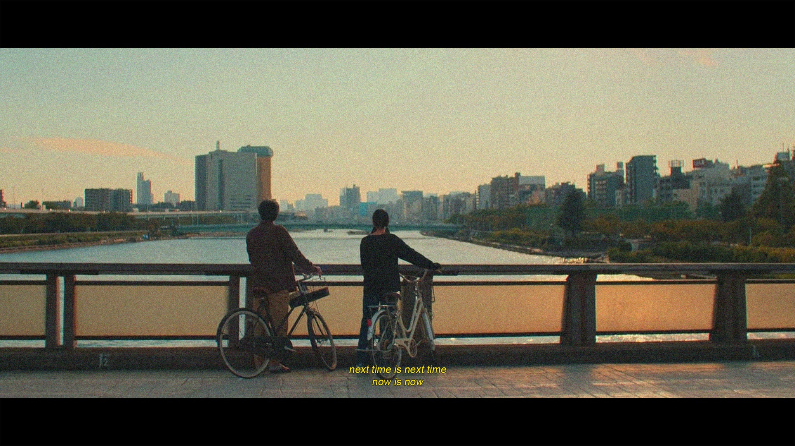

# Zubair Rahman Tusar

**Manager, AI & Data Science** | **Researcher**

[](https://linkedin.com/in/ztusar)
[](https://scholar.google.com/citations?user=nRQqx3wAAAAJ)
[](mailto:zubairrahman@iut-dhaka.edu)
[](https://zubairtusar.github.io/zubairtusar)

---

<div align="center">



**"Kondo wa kondo, Ima wa ima"**

*,  Perfect Days*

</div>

---

## 🚀 About Me

I'm focused on building AI systems that matter today. With **3+ years** at **Robi Axiata Limited**, I work on production-scale machine learning, **contextual AI**, **geospatial analytics**, and **agentic LLM applications**, solving real problems right now while learning what comes next.

🎯 **Present Focus**: Delivering AI solutions across customer analytics, network optimization, and generative AI  
📍 **Location**: Dhaka, Bangladesh  
🎓 **Education**: B.Sc in Software Engineering, Islamic University of Technology (CGPA: 3.64/4.00)

---

## 💼 Professional Experience

### 🏢 **Robi Axiata Limited** | *Manager, AI and Data Science* | *Feb 2024 – Present*

**Building AI solutions that deliver value today:**

#### 🎯 **Customer Portfolio**
- **ARPU Enhancer**: Designing contextual multi-armed bandit system for immediate offer optimization
- **Offer Response Model**: Deployed custom LSTM achieving ~70% recall in current production
- **Customer Segmentation**: Analyzing 50M+ customers to enable targeted actions now

#### 📡 **Network Portfolio** 
- **Coverage Monitor**: Transformed geospatial analysis from 2 weeks to 2 hours, decisions happen faster
- **Site Recommender**: Delivered **58% business potential gain** through set-cover optimization
- **Propagation Model**: Created urbanization-aware regressor (~200m RMSE) for today's network planning

#### 🤖 **Generative AI Leadership**
- Leading **GenAI adoption** across the organization as it happens
- Running hands-on workshops on **prompt engineering** and **RAG systems**

#### 🎖️ **Recognition**: Top 5% performer | 6× Star Performer | Divisional Champion

---

### 🔬 **Intelligent Machines Ltd** | *AI Engineer* | *May 2021 – Sep 2022*

- **Production Quality System**: Built real-time fault detection using computer vision
- **Document Verification**: Created identity fraud detection with OCR and edge-detection
- **Synthetic Data Generation**: Worked on GTA V-based synthetic data for license plate detection

---

## 📚 Publications & Research

### 📄 **Published Research**

1. **"Effectiveness of Data Augmentation and Ensembling Using Transformer-Based Models for Sentiment Analysis"**  
   *ICSOFT 2023* | **1st Author** | [📖 Paper](https://www.scitepress.org/Link.aspx?doi=10.5220/0012092500003538)  
   *Achieved 1-26% improvement in F1 scores using SE-vocabulary augmentation*

2. **"Accelerometer-based Complex Nurse Care Activity Recognition using Machine Learning"**  
   *UbiComp/ISWC'21 Adjunct* | **1st Author** | [📖 Paper](https://dl.acm.org/doi/10.1145/3460418.3479390)  
   *🥉 3rd Place - International HASCA Challenge 2021*

---

## 🛠️ Featured Projects

### 🤖 **Paralegal Agent & Visa Petition System**
**Agentic AI | RAG | Full-Stack Development**
- Multi-agent orchestration with **n8n workflows** operating in real-time
- PDF/form ingestion with automated fact extraction
- **Next.js/React** frontend with **Supabase** backend
- Vector search delivering instant document retrieval

### 📱 **Movement-Monitoring Wearable**
**Edge AI | IoT | Healthcare**
- On-device anomaly detection providing immediate patient insights
- **Raspberry Pi Zero W** + **MPU-9250 IMU**
- Real-time inference with instant caregiver alerts
- [🔗 GitHub Repository](https://github.com/zubairtusar/movement_recognition_system)

### 🏪 **Trade Visibility System** *(Professional)*
**Computer Vision | Production Scale**
- Monitoring **700k+ retail outlets** continuously
- Object detection models with **~75% recall** running in production
- Real-time brand material visibility tracking

---

## 🏆 Achievements & Recognition

### 🎖️ **Professional Awards**
- **Top 5%** performer in 2023-2024 evaluations
- **6× Star Performer** (Q1'23 - Q3'24) for consistent delivery
- **Divisional Champion** - Hall of Honor for innovation & collaboration

### 🏅 **Competition Success**
- **🥈 Top 2%** - Robi Datathon 2.0 (National, 2022)
- **🥉 3rd Place** - HASCA International Challenge (2021)
- **🥈 2nd Place** - Photography Contest (National, 2019)
- **🥈 2nd Place** - University Programming Contest (2018)

---

## 🔧 Technical Expertise

```python
skills = {
    "AI/ML": ["PyTorch", "TensorFlow", "LSTM/RNN", "Contextual Bandits", "Multi-Armed Bandits"],
    "Computer Vision": ["YOLO", "OpenCV", "OCR", "Object Detection", "Edge Detection"],
    "LLM Systems": ["RAG", "Prompt Engineering", "Agentic Systems", "Vector Search", "n8n"],
    "Data & Analytics": ["SQL", "PySpark", "GeoPandas", "Spatial Indexing", "Statistical Modeling"],
    "Geospatial": ["KD/Ball Trees", "Location Intelligence", "Network Propagation", "Coverage Analysis"],
    "Infrastructure": ["Docker", "Kubernetes", "Azure", "AWS", "PostgreSQL"],
    "Web Development": ["Next.js", "React", "Flask", "Streamlit", "JavaScript"],
    "Languages": ["Python", "C/C++", "JavaScript", "SQL"]
}
```

---

## 📊 GitHub Stats

<div align="center">


</div>

---

## 🎓 Education & Certifications

**🎓 B.Sc in Software Engineering** | *Islamic University of Technology* | *2018-2022*  
**CGPA**: 3.64/4.00 (Last 4 semesters: 3.88)

**📜 IELTS**: Band 7.5 (Speaking: 8.0 | Listening: 7.5 | Writing: 7.0 | Reading: 6.5)

**🏅 Leadership**: Head of Creative Fields - IUT Photography Society | Student Mentor

---

## 🤝 Let's Connect!

[](https://linkedin.com/in/ztusar)
[](mailto:zubairrahman@iut-dhaka.edu)
[](https://zubairtusar.github.io/zubairtusar)

---

